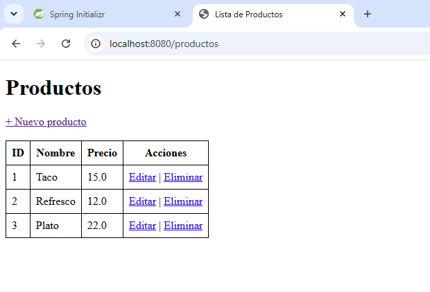
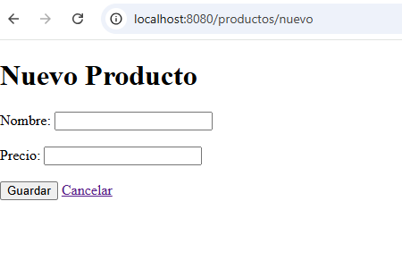

# Lab_POO_031

# CRUD Spring Boot

## Descripción

Aplicación web CRUD desarrollada con Spring Boot para la gestión de productos.

El sistema permite:

* Crear productos.
* Consultar productos registrados.
* Editar productos existentes.
* Eliminar productos.

La información se almacena en una base de datos MySQL utilizando Spring Data JPA.

---

## Tecnologías Utilizadas

* Java 17
* Spring Boot
* Spring Data JPA
* Thymeleaf
* MySQL
* Maven

---

## Estructura del Proyecto

```text
src
├── controller
│   └── ProductoController.java
├── entity
│   └── Producto.java
├── repository
│   └── ProductoRepository.java
├── templates
│   ├── lista.html
│   └── formulario.html
└── application.properties
```


## Funcionalidades

### Listar productos

Muestra todos los productos registrados.

### Agregar producto

Permite registrar un nuevo producto indicando:

* Nombre
* Precio

### Editar producto

Permite modificar la información de un producto existente.

### Eliminar producto

Permite eliminar un producto de la base de datos.

---

## Evidencias

### Pantalla principal



### Formulario de captura



---

## Autor

Emilio Martinez Verduzco
2086026
Grupo 031
